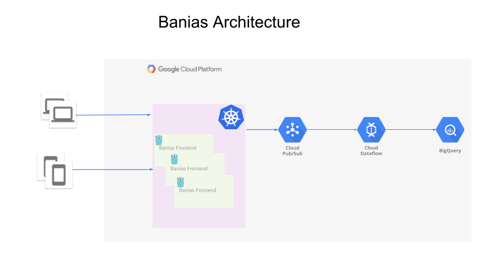

# Banias

  

Banias (Arabic: بانياس الحولة‎; Hebrew: בניאס‬) is the Arabic and modern Hebrew name of an ancient site developed around a river once associated with the Greek god [Pan](https://www.wikiwand.com/en/Pan_(mythology)).

So, like the flow of the Banias, events are flowing into our system. So we decided to build a reference architecture and actual implementation of event analytics pipeline. You can take the code as it is and use it or use it a design reference.

Banias Architecture:
* API receiving the events data from the producers (e.g. web apps, mobile app or backend servers)
* The events are sent to Google Pub/Sub topic
* Apache Beam/Google Cloud Dataflow streams the events into BigQuery with or without mutations or agregations

## Installtion

### [API Deployment](frontend/README.md)

### [Apache Beam/Google Cloud Dataflow Deployment](backend/README.md)
